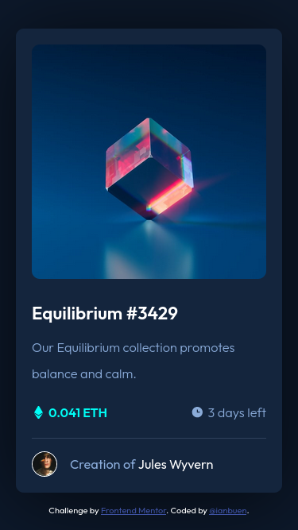
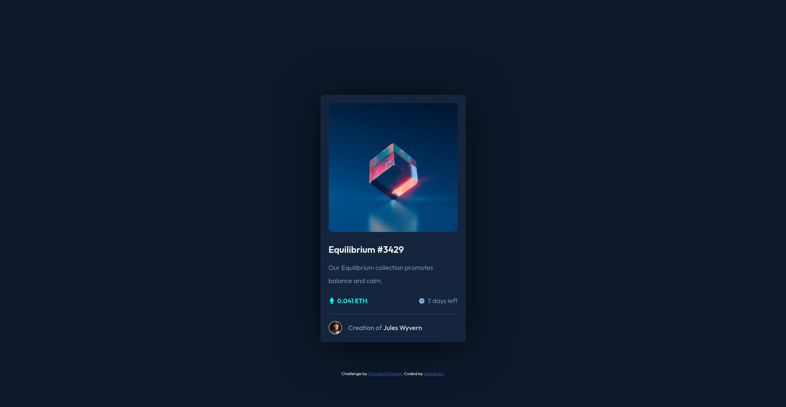

# Frontend Mentor - NFT preview card component solution

This is a solution to the [NFT preview card component challenge on Frontend Mentor](https://www.frontendmentor.io/challenges/nft-preview-card-component-SbdUL_w0U). Frontend Mentor challenges help you improve your coding skills by building realistic projects. 

## Table of contents

- [Overview](#overview)
  - [The challenge](#the-challenge)
  - [Screenshot](#screenshot)
  - [Links](#links)
- [My process](#my-process)
  - [Built with](#built-with)
  - [What I learned](#what-i-learned)
  - [Continued development](#continued-development)
  - [Useful resources](#useful-resources)
- [Author](#author)

## Overview

### The challenge

Users should be able to:

- View the optimal layout depending on their device's screen size
- See hover states for interactive elements

### Screenshot

 

### Links

- Solution URL: [Add solution URL here](https://your-solution-url.com)
- Live Site URL: [Add live site URL here](https://ianbuen.github.io/nft-preview-card/)

## My process

### Built with

- Semantic HTML5 markup
- Sass
- Flexbox
- CSS Grid
- Mobile-first workflow 

### What I learned

I'm no expert in Sass, so I've gotten rusty. But still the best time to use a style pre-processor, than never. I've relearned the basics, such as using mixins, nesting, and inheritance.

### Continued development

I am yet to dig deeper into the features of Sass. Pretty sure I was just at the tip of the iceberg. Looking forward to utilizing Sass for easier styling.

### Useful resources

- [Official Sass Guide](https://sass-lang.com/guide) - This helped me get up to speed with setting up Sass as well as the basics.

## Author

- GitHub - [@ianbuen](https://github.com/ianbuen)
- Frontend Mentor - [@ianbuen](https://www.frontendmentor.io/profile/ianbuen)